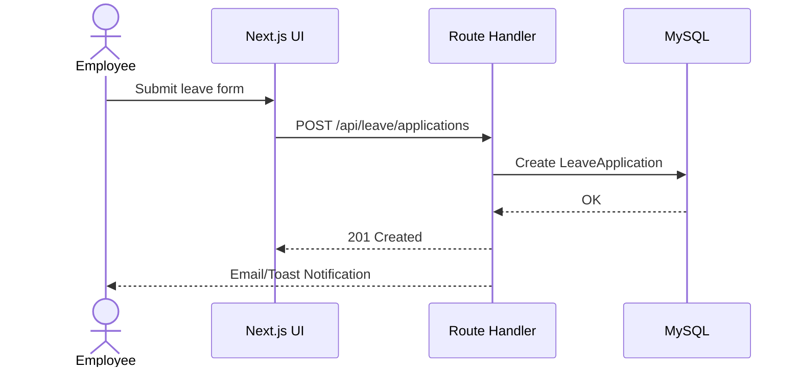

## Introduction

This document outlines the complete fullstack architecture for OALASS (Online Absence & Leave Application Support System), covering backend, frontend, and integrations. It is the single source of truth guiding development across the stack.

Starter Template or Existing Project: Existing Next.js App Router project with NextAuth, Prisma (MySQL), Tailwind CSS, shadcn/ui, and sonner. Deployment targets Vercel/Node and a MySQL database.

Change Log
| Date | Version | Description | Author |
| --- | --- | --- | --- |
| 2025-10-20 | 1.0 | Initial architecture document | Architect Agent |

## High Level Architecture

### Technical Summary
OALASS uses Next.js App Router (RSC) with route handlers and server actions for backend logic. Authentication is handled by NextAuth with JWT sessions and a Prisma adapter on MySQL. UI uses shadcn/ui and Tailwind CSS; notifications via sonner. Access control is enforced by middleware and role-aware routing. The system supports realtime via a Node-based WebSocket server for application updates.

### Platform and Infrastructure Choice
**Platform:** Vercel (frontend+edge) + Managed MySQL (PlanetScale/RDS) or VPS Node for WebSocket
**Key Services:** Next.js, NextAuth, Prisma, MySQL, Node WebSocket, Email (SMTP/Gmail)
**Deployment Host and Regions:** Vercel multi-region CDN for static/edge; DB in same region group

Recommendation: Vercel for UI and route handlers; managed MySQL for reliability; optional separate Node process (or Vercel cron/queues alternative) for long-lived WebSocket server as already present.

### Repository Structure
**Structure:** Single repo, Next.js App Router with domain-focused `src/lib`, `src/app/(role)` segments.
**Monorepo Tool:** N/A (single app). Could adopt npm workspaces if splitting shared packages later.
**Package Organization:** UI in `components/ui`; domain logic in `lib`; API under `app/api`.

### High Level Architecture Diagram
```mermaid
graph TD
  U[Users] -->|HTTPS| FE[Next.js (App Router)]
  FE -->|Route Handlers/Server Actions| API[Next.js Route Handlers]
  API --> DB[(MySQL via Prisma)]
  FE --> WSS[WebSocket Server]
  API --> SMTP[Email (SMTP/Gmail)]
  FE --> CDN[CDN/Edge]
  subgraph Auth
    API --> NA[NextAuth + JWT + PrismaAdapter]
  end
```

### Architectural Patterns
- **Server-First RSC:** Backend logic colocated with UI for SSR and data-fetch efficiency - _Rationale:_ Simpler data flow and caching.
- **Repository/Data Access via Prisma:** Encapsulate queries in `lib` - _Rationale:_ Maintainability and testability.
- **BFF (Backend For Frontend) via Route Handlers:** Tailored endpoints per UI - _Rationale:_ Simplifies contracts and auth.
- **Role-Based Access Control:** Middleware and session-enriched roles - _Rationale:_ Security and clarity of permissions.

## Tech Stack

| Category | Technology | Version | Purpose | Rationale |
| --- | --- | --- | --- | --- |
| Frontend Language | TypeScript | latest | Type safety | Reliability, DX |
| Frontend Framework | Next.js App Router | 15.4.5 | SSR/RSC, routing | Performance, DX |
| UI Component Library | shadcn/ui + Tailwind | latest | UI primitives/styles | Consistency, velocity |
| State Management | React state + providers | - | Local + provider state | Simplicity |
| Backend Language | TypeScript | latest | Shared types | Consistency |
| Backend Framework | Next.js route handlers | 15.4.5 | API and server actions | Co-location |
| API Style | REST (route handlers) | - | Simple integration | Fits Next.js |
| Database | MySQL via Prisma | ^6.13.0 | Persistence | Mature, relational |
| Cache | In-memory/Edge (future) | - | Perf | Optional future |
| File Storage | DB/Text or object store (future) | - | Attachments | Evolvable |
| Authentication | NextAuth (JWT) | ^4.24.11 | AuthN/Z | Standard + adapters |
| Frontend Testing | Vitest/React Testing Lib (future) | - | Unit tests | Coverage |
| Backend Testing | Vitest (future) | - | Unit/integration | Coverage |
| E2E Testing | Playwright (future) | - | E2E flows | Confidence |
| Build Tool | Next build | - | Production build | Official |
| Bundler | SWC/Next | - | Transpile/bundle | Default |
| IaC Tool | Manual/Host console (initial) | - | Infra config | Simplicity |
| CI/CD | Vercel + GitHub | - | Deploy pipeline | Speed |
| Monitoring | Logs + Browser perf APIs | - | Observability | Lightweight |
| Logging | Console + platform logs | - | Diagnostics | Simplicity |

## Data Models (Conceptual)

### User
**Purpose:** Identity, profile, role, department

**Key Attributes:**
- users_id: string - primary key
- email: string - unique
- role_id: int - role relation
- department_id: int? - department relation

Relationships
- User 1..* LeaveApplication
- User 1..* Notification

### LeaveApplication
**Purpose:** Leave requests and status lifecycle

**Key Attributes:**
- leave_application_id: int - pk
- users_id: string - applicant
- status: enum - workflow status
- leave_type_id: int - type selected

Relationships
- LeaveApplication *..1 User
- LeaveApplication *..1 leave_types

## API Specification (REST)

OpenAPI (excerpt)
```yaml
openapi: 3.0.0
info:
  title: OALASS API
  version: 1.0.0
paths:
  /api/user/profile:
    get:
      summary: Get current user profile
    patch:
      summary: Update current user profile
  /api/user/change-password:
    post:
      summary: Change password for current user
```

## Components

### Auth Service (NextAuth)
**Responsibility:** Session/JWT, callbacks enrich session with role/department.
**Interfaces:** `/api/auth/[...nextauth]`
**Dependencies:** Prisma Adapter, User/Role tables
**Technology Stack:** NextAuth v4, Prisma, bcryptjs

### Leave Service
**Responsibility:** CRUD leave applications, validations, balances
**Interfaces:** Route handlers under `app/api/leave/*`
**Dependencies:** Prisma, validation schemas (Zod)
**Technology Stack:** Next.js route handlers, Prisma

## Core Workflows



## Database Schema (Prisma-driven)

- MySQL with Prisma models: `User`, `Role`, `Department`, `leave_types`, `LeaveApplication`, `Notification`, etc.
- Indices on foreign keys and createdAt for sorting.

## Frontend Architecture

- App Router with segmented layouts (`app/(role)/...`).
- UI primitives from shadcn/ui; global styles in `src/app/globals.css`.
- Provider pattern in `src/app/layout.tsx` for session, theme, realtime, and toaster.

Routing Organization (example)
```
app/
  dashboard/
  admin/
  dean/
  teacher/
  api/
```

Protected Route Pattern: enforced via `middleware.ts` and client checks in role layouts.

## Backend Architecture

Service Architecture: Route handlers for CRUD and server actions for mutations with Zod validation and `revalidatePath` where needed.

Data Access Layer: Prisma client singleton in `src/lib/prisma.ts`; optional repository helpers in `src/lib/*`.

Auth Flow: NextAuth callbacks enrich token and session; middleware uses token to guard routes.

## Unified Project Structure

Single-repo Next.js app with `src/app`, `src/components`, `src/lib`, `prisma`, `public`, `scripts`, and `docs`.

## Development Workflow

- Prerequisites: Node LTS, MySQL instance, env vars
- Setup: `npm i` → `npm run db:push` → `npm run dev`
- Dev Commands: `npm run dev`, `npm run dev:full` (with WebSocket server)

Environment Configuration
- Frontend: NextAuth URLs, public keys
- Backend: DATABASE_URL or DB_* vars (auto-synthesized in prisma client)
- Shared: SMTP credentials for email

## Deployment Architecture

Frontend Deployment
- Platform: Vercel
- Build Command: `npm run build`
- Output: `.next`
- CDN/Edge: Vercel CDN

Backend Deployment
- Platform: Vercel (route handlers) + optional Node process for WebSocket
- Build: `npm run build`
- Method: Vercel auto-deploy; Node service on VPS if needed

CI/CD Pipeline
- GitHub → Vercel preview/prod

Environments
- Development: localhost
- Staging: Vercel preview, staging DB
- Production: Vercel prod, prod DB

## Security and Performance

Frontend Security
- CSP headers (platform-level), sanitize inputs client-side

Backend Security
- Zod validation at API/server actions; rate-limit sensitive endpoints (future); strict CORS defaults

Authentication Security
- JWT sessions; minimal token surface; rotate secrets per environment

Performance Optimization
- RSC for server data; avoid over-fetch; Prisma query logs in dev for tuning; indices on hot paths

## Testing Strategy

- Pyramid: unit → integration → E2E
- Frontend: component tests with RTL (future)
- Backend: handler tests with Vitest (future)
- E2E: Playwright covering critical flows (future)

## Coding Standards

- Types live in `src/types` or shared modules; avoid `any`
- Never mutate shared state; use provider/local state
- API calls via fetch wrappers or server actions; no direct DB from client
- env vars accessed via typed config helpers

## Error Handling Strategy

- Unified error shape for APIs; toast user-facing errors; log server details securely

```ts
interface ApiError {
  error: { code: string; message: string; details?: Record<string, any>; timestamp: string; requestId: string };
}
```

## Monitoring and Observability

- Frontend: Web Vitals, error boundary reporting
- Backend: Platform logs; structured console logs; DB query warnings in dev

## Checklist Results Report

Pending: Run `architect-checklist` to validate architecture and record outcomes here.


